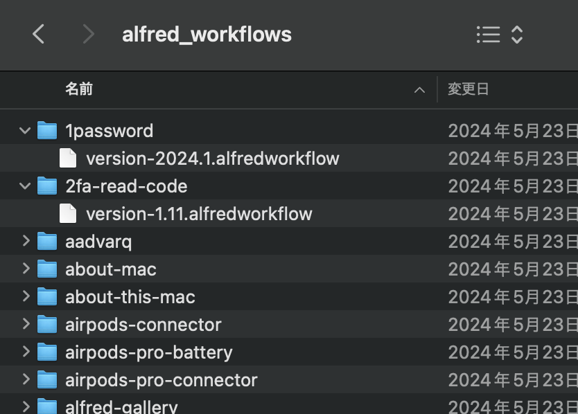
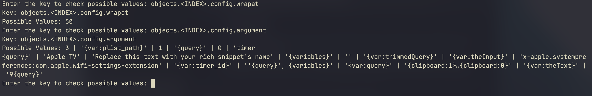

# Alfred workflows spec

> [!NOTE]
> I have to check every possible workflow

## Usage

### 1. Download all alfred workflows



dependencies: `curl`, `parallel`, `htmlq`

```bash
./download_alfred_workflows.sh
```

### 2. Extract info.plist for inspection and analysis

dependencies: `find`, `parallel`

```bash
./extract_info_plist.sh
```

### 3. Extract all possible keys from info.plist

dependencies: `bun`

```bash
bun install
bun run analysis/01_extract_keys.js
```

This would update the `all_keys.json` file

### 4. Run the value checker repl to update the typing in `alfred.ts`



```bash
bun run analysis/02_query_values.js
```
